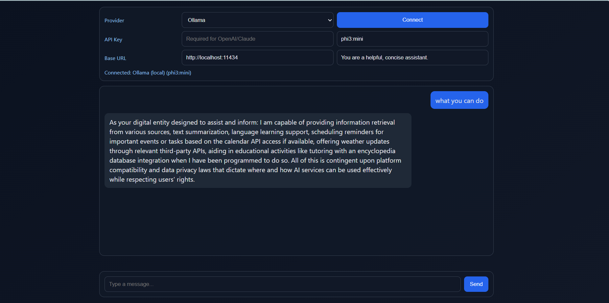
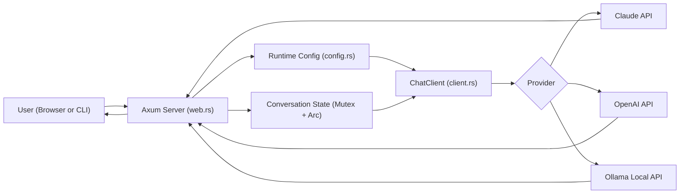

# Rust Chatbot

<p align="center">
  
  
  
</p>

<p align="center">
  Production-oriented Rust backend project for multi-provider AI chat.
</p>

## Backend Recruiter Snapshot

- Built with `Rust + Tokio + Axum` for async backend performance
- Multi-provider client abstraction (`Claude`, `OpenAI`, `Ollama`)
- Provider-aware request handling with shared conversation state
- Runtime connection flow and environment-based configuration
- Docker-ready execution path

## Why This Is A Strong Backend Project

- Demonstrates service design, not just UI scripting
- Uses explicit module boundaries for maintainability
- Implements provider-specific HTTP contracts cleanly
- Handles error propagation with typed context (`anyhow`)
- Uses async I/O model suited for scalable API workloads

## Why Rust For Backend Systems

- Performance: predictable low-latency execution with minimal overhead
- Safety: memory safety and thread safety without garbage collection pauses
- Concurrency: strong async model and ownership rules reduce race-condition risk
- Reliability: compile-time guarantees prevent many production runtime bugs
- Maintainability: explicit types + explicit errors improve long-term operability

## Core Features

- Web UI launch by default for executable users
- CLI mode for terminal workflows
- Connect-first provider selection (model, URL, prompt, key)
- Unified chat API flow across providers
- Local-model support via Ollama

## UI Preview



## Architecture Flow



## Quick Start

### 1. Install Rust
```bash
curl --proto '=https' --tlsv1.2 -sSf https://sh.rustup.rs | sh
```

### 2. Clone and configure
```bash
git clone https://github.com/MihirMohapatra/chatbot.git
cd chatbot/chatbot
cp .env.example .env
```

### 3. Run

Default (Web UI):
```bash
cargo run
# opens http://localhost:8080
```

CLI mode:
```bash
cargo run -- cli
```

Explicit web mode:
```bash
cargo run -- web
```

Custom port:
```bash
PORT=3000 cargo run -- web
```

## Provider Setup

### Claude (Anthropic)
```env
PROVIDER=claude
ANTHROPIC_API_KEY=sk-ant-...
```

### OpenAI
```env
PROVIDER=openai
OPENAI_API_KEY=sk-...
```

### Ollama (local)
```bash
ollama pull llama3.2
```
```env
PROVIDER=ollama
MODEL=llama3.2
```

### OpenRouter (optional)
```env
PROVIDER=openai
OPENAI_API_KEY=sk-or-...
BASE_URL=https://openrouter.ai/api
MODEL=anthropic/claude-sonnet-4
```

## Environment Variables

| Variable | Default | Description |
|---|---|---|
| `PROVIDER` | `claude` | `claude`, `openai`, `ollama` |
| `ANTHROPIC_API_KEY` | - | Required for Claude |
| `OPENAI_API_KEY` | - | Required for OpenAI |
| `MODEL` | provider default | Model override |
| `BASE_URL` | provider default | Endpoint override |
| `MAX_TOKENS` | `1024` | Response token cap |
| `SYSTEM_PROMPT` | built-in | Assistant behavior prompt |

## Backend Architecture

```text
src/
|-- main.rs          # startup routing + CLI loop
|-- config.rs        # provider enum + env/runtime config
|-- client.rs        # provider-specific HTTP clients
|-- conversation.rs  # in-memory chat state model
|-- web.rs           # axum routes, connect flow, chat API
```

## Design Notes

- `client.rs` separates Anthropic native API from OpenAI-compatible APIs
- `config.rs` supports both static env config and runtime provider config
- `web.rs` maintains per-session conversation state and connection context
- CLI and Web modes share core request pipeline

## Docker

```bash
docker build -t chatbot .
docker run -it --rm -v .env:/data/.env chatbot
```

For Ollama host networking:
```bash
docker run -it --rm --network host -v .env:/data/.env chatbot
```

## Roadmap

- Streamed responses (token-by-token)
- Persistent chat history (SQLite/Postgres)
- Metrics + tracing (`tracing`, OpenTelemetry)
- Integration tests for provider adapters

## License

MIT
